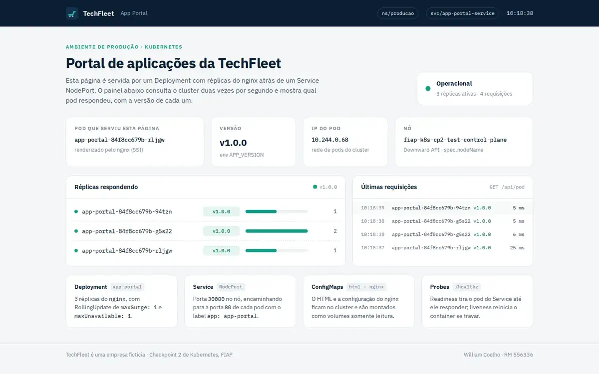
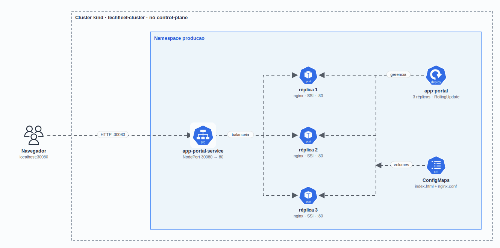
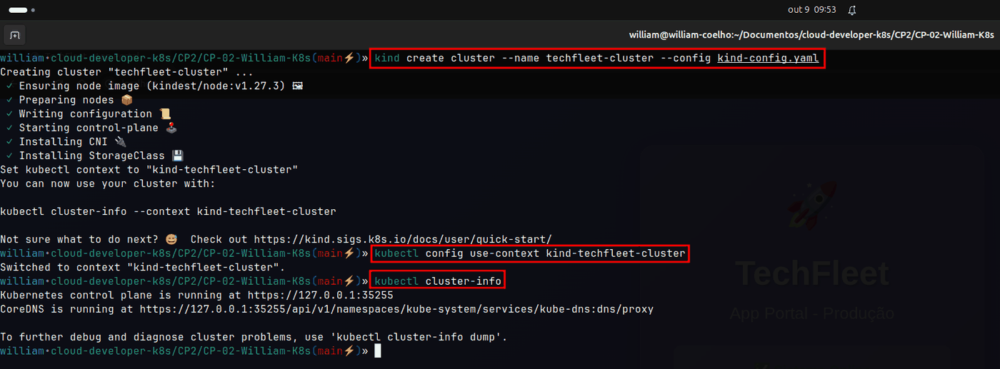
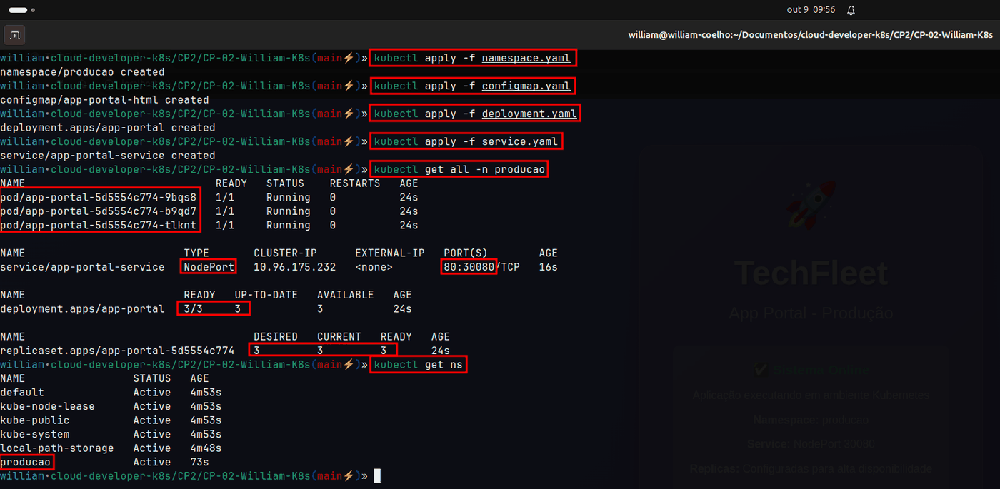
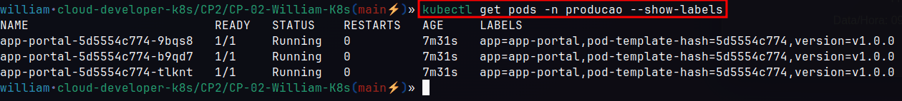
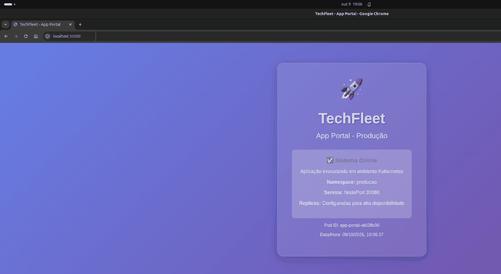
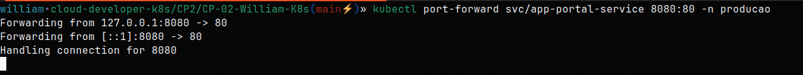
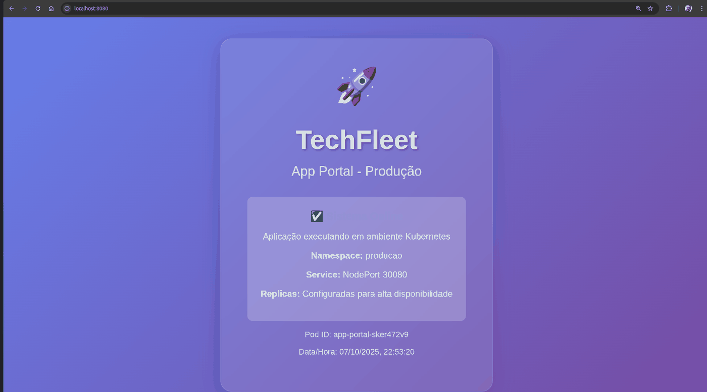
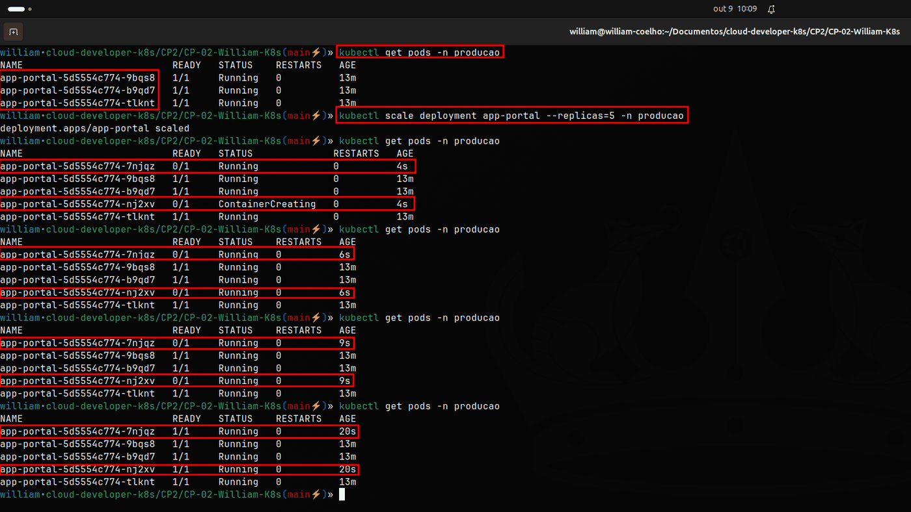
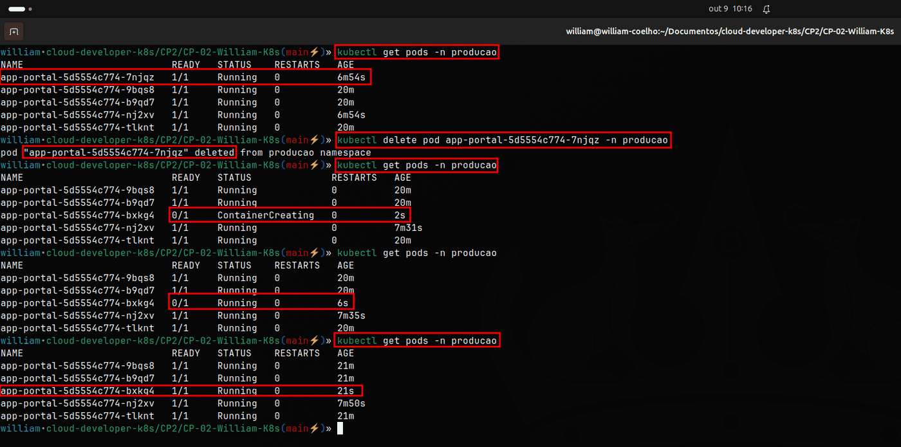

<h1 align="center">
  CP2 - TechFleet App Portal no Kubernetes
</h1>

<p align="center">
  
</p>

<p align="center">
  <a href="https://skillicons.dev">
    
  </a>
</p>

## Qual a finalidade do projeto?

Checkpoint 2 da disciplina de **Kubernetes** (FIAP, outubro de 2025). O cenário é a empresa fictícia **TechFleet**, que está migrando as aplicações para containers orquestrados e precisa de um ambiente de produção simulado com **alta disponibilidade, escalabilidade e resiliência**.

A entrega sobe o **App Portal** num cluster local com **kind**: um namespace `producao`, um Deployment `app-portal` com 3 réplicas do `nginx:latest`, um Service NodePort na porta **30080** e a página do portal num **ConfigMap**. Depois vêm os testes pedidos no enunciado: escalar para 5 réplicas e excluir um pod para ver o Kubernetes recriá-lo.

Na revisão do projeto a página ganhou um **painel ao vivo**: ela consulta o Service duas vezes por segundo e mostra qual pod respondeu e com qual versão. Assim dá para ver na tela o balanceamento entre as réplicas, a escala e o rolling update acontecendo.

## Arquitetura

<p align="center">
  
</p>

## O que foi construído

### Recursos no cluster

| Recurso | Nome | Detalhes |
|---|---|---|
| Namespace | `producao` | Labels `environment: production` e `project: techfleet-app-portal` |
| Deployment | `app-portal` | 3 réplicas, `nginx:latest`, RollingUpdate com `maxSurge: 1` e `maxUnavailable: 1` |
| Service | `app-portal-service` | NodePort `30080` → porta `80` dos pods com `app: app-portal` |
| ConfigMap | `app-portal-html` | `index.html` do portal, montado em `/usr/share/nginx/html` |
| ConfigMap | `app-portal-nginx` | `default.conf.template` do nginx, montado em `/etc/nginx/templates` |

### Requisitos do checkpoint

| Requisito | Como foi atendido |
|---|---|
| Cluster local | kind com `kind-config.yaml` (porta 30080 do nó exposta no host) |
| Namespace `producao` | `k8s/namespace.yaml` |
| Deployment com 3 réplicas e label `app: app-portal` | `k8s/deployment.yaml` |
| Service NodePort 30080 → 80 | `k8s/service.yaml` |
| Escalar para 5 réplicas | `kubectl scale`, conferido pelo `scripts/validar.sh` |
| Excluir um pod e ver a recuperação | `kubectl delete pod`, conferido pelo `scripts/validar.sh` |
| Mensagem personalizada no `index.html` | Portal da TechFleet no ConfigMap `app-portal-html` |

### O que a revisão acrescentou

| Melhoria | Como funciona |
|---|---|
| Nome real do pod na página | O nginx usa **SSI** (`ssi on`): `<!--# echo var="hostname" -->` vira o nome do pod que respondeu. Antes a página sorteava um id aleatório |
| Painel ao vivo das réplicas | A página chama `GET /api/pod` duas vezes por segundo. A rota responde sem keep-alive, então cada chamada abre uma conexão nova e o Service distribui entre os pods |
| Versão e nó por variável | `APP_VERSION` (valor fixo) e `NODE_NAME` (Downward API) entram no template do nginx pelo `envsubst` da imagem oficial |
| Probes em `/healthz` | Readiness e liveness numa rota leve, sem depender da página |
| Rolling update sem perder requisição | `preStop` com `sleep 5` dá tempo do Service tirar o pod dos endpoints antes do nginx parar. Sem ele, o teste perdia 1 requisição em cada 100 durante o rollout |
| Manifestos em `k8s/` com Kustomize | `kubectl apply -k k8s` aplica tudo na ordem. Antes, `kubectl apply -f .` falhava por tentar aplicar o `kind-config.yaml` |
| Validação automática | `scripts/validar.sh` testa a entrega inteira; o GitHub Actions roda o mesmo script num cluster kind |

### Rotas servidas pelo nginx

| Rota | O que devolve |
|---|---|
| `GET /` | Portal da TechFleet, com o pod, o IP, o nó e a versão preenchidos pelo SSI |
| `GET /api/pod` | `{"pod": "...", "ip": "...", "node": "...", "version": "..."}` do pod que atendeu |
| `GET /healthz` | `ok` (usado pelas probes) |

## Tecnologias utilizadas

- **Kubernetes:** Namespace, Deployment, Service NodePort, ConfigMaps, probes e Downward API;
- **kind:** cluster Kubernetes local dentro do Docker;
- **Kustomize (`kubectl apply -k`):** aplica os manifestos na ordem certa;
- **nginx:** serve o portal, com SSI e rotas próprias no template de configuração;
- **HTML, CSS e JavaScript:** página do portal, sem bibliotecas (fontes IBM Plex pelo Google Fonts);
- **Bash:** script de validação da entrega;
- **GitHub Actions:** kubeconform, shellcheck e deploy de verdade num cluster kind.

## Estrutura do repositório

```text
fiap-k8s-cp2/
├── k8s/
│   ├── kustomization.yaml    # Lista e ordem dos manifestos
│   ├── namespace.yaml        # Namespace producao
│   ├── configmap.yaml        # index.html do portal (com SSI)
│   ├── nginx-configmap.yaml  # Template do nginx: SSI, /api/pod e /healthz
│   ├── deployment.yaml       # app-portal: 3 réplicas, probes, preStop e volumes
│   └── service.yaml          # NodePort 30080
├── kind-config.yaml          # Cluster kind com a porta 30080 exposta no host
├── scripts/validar.sh        # Testa deploy, NodePort, escala, resiliência e rollout
├── .github/workflows/ci.yml  # Validação dos manifestos e teste num cluster kind
└── docs/
    ├── arch.gif              # Diagrama de arquitetura
    ├── demo.webp             # Demo do portal
    └── prints/               # Evidências da entrega original (outubro de 2025)
```

## Fluxo de funcionamento

1. O navegador acessa `http://localhost:30080`. O kind repassa a porta do host para a porta 30080 do nó.
2. O Service `app-portal-service` recebe a conexão e escolhe um dos pods com o label `app: app-portal`.
3. O nginx do pod lê o `index.html` do ConfigMap e, pelo SSI, escreve na página o nome do pod, o IP, o nó e a versão.
4. No navegador, o painel chama `/api/pod` duas vezes por segundo e monta a lista de réplicas que responderam, com a contagem e a versão de cada uma.
5. Num `kubectl scale` ou num rolling update, os pods novos aparecem no painel assim que ficam prontos (readiness em `/healthz`) e os antigos somem depois de encerrados.

## Como rodar

Pré-requisitos: Docker, [kind](https://kind.sigs.k8s.io/docs/user/quick-start/#installation) e kubectl.

```bash
kind create cluster --name techfleet-cluster --config kind-config.yaml
kubectl apply -k k8s
kubectl -n producao rollout status deployment/app-portal
```

Acesse **http://localhost:30080**.

Comandos do enunciado:

```bash
kubectl get all -n producao
kubectl get pods -n producao --show-labels

# Escalabilidade: 3 -> 5 réplicas
kubectl scale deployment app-portal --replicas=5 -n producao

# Resiliência: exclua um pod e veja outro ser criado no lugar
kubectl delete pod <nome-do-pod> -n producao
kubectl get pods -n producao -w

# Acesso alternativo, sem NodePort
kubectl port-forward svc/app-portal-service 8080:80 -n producao
```

Para ver o rolling update no painel (a demo acima), com o portal aberto:

```bash
kubectl set env deployment/app-portal APP_VERSION=1.1.0 -n producao
kubectl rollout status deployment/app-portal -n producao
kubectl rollout undo deployment/app-portal -n producao   # volta para a v1.0.0
```

Para apagar tudo:

```bash
kubectl delete -k k8s
kind delete cluster --name techfleet-cluster
```

## Como validar a entrega

Com o cluster criado:

```bash
./scripts/validar.sh              # usa http://localhost:30080
```

Saída de uma execução real:

```text
1. Aplicando os manifestos
  ok  Deployment com 3 réplicas prontas
2. Acesso pelo NodePort (http://localhost:30080)
  ok  /healthz responde
  ok  página do portal servida pelo ConfigMap
  ok  Service distribuiu 30 requisições entre 3 pods
3. Escalabilidade: 3 -> 5 réplicas
  ok  5 réplicas prontas
  ok  de volta a 3 réplicas
4. Resiliência: excluindo um pod
  ok  app-portal-549587dcb6-bmjwb excluído e substituído; 3 pods prontos de novo
5. Rolling update: v1.0.0 -> v1.1.0 e rollback
  ok  todas as réplicas atualizadas para v1.1.0
      durante o rollout: 89 respostas ok, 0 falhas
  ok  nenhuma requisição perdida durante o rollout
  ok  rollback para v1.0.0
Tudo certo.
```

O mesmo script roda no GitHub Actions a cada push e pull request, num cluster kind criado com o `kind-config.yaml` deste repositório, depois da validação dos manifestos com **kubeconform** e do **shellcheck**.

### Evidências da entrega original

Prints de outubro de 2025, da primeira versão (manifestos ainda na raiz e a página antiga).

| Etapa | Print |
|---|---|
| Cluster kind criado e `kubectl cluster-info` |  |
| Manifestos aplicados e `kubectl get all -n producao` |  |
| Labels dos pods |  |
| Portal pelo NodePort 30080 |  |
| `kubectl port-forward` |  |
| Portal pelo port-forward |  |
| Escala de 3 para 5 réplicas |  |
| Pod excluído e recriado |  |

---

## Autor

**William Coelho** · RM 556336 · [@willtechdev](https://github.com/willtechdev)
